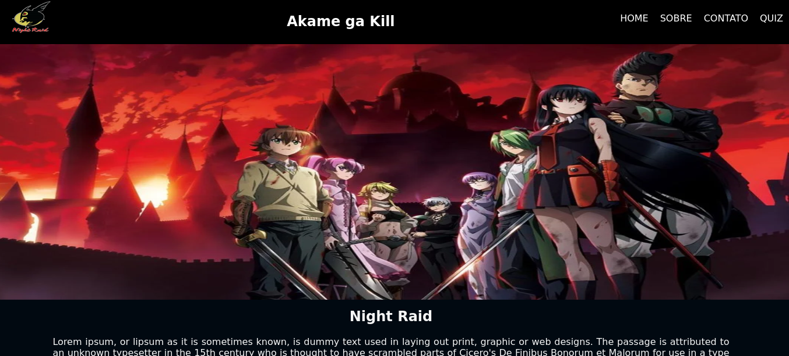
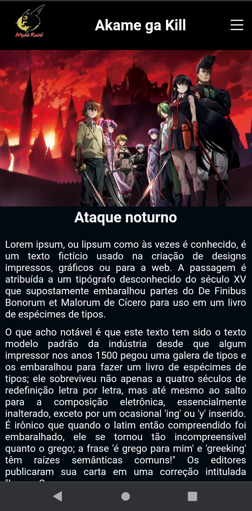
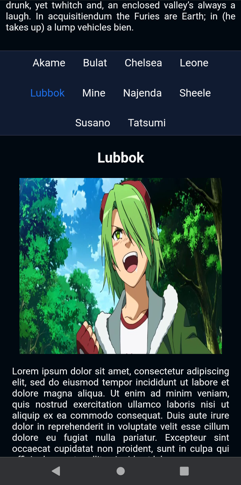

  <h1>Página sobre o grupo "Night Raid" do anime Akame ga Kill. </h1>
    
    
    
     
     
     
   

   

 O projeto consiste em uma página web desenvolvida com React e CSS, sobre o grupo "Night Raid" do anime Akame ga Kill. Ademais, a página permite que o usuário explore informações sobre os integrantes do grupo de forma interativa.

Ao clicar no nome de um dos integrantes, a página exibe dinamicamente o nome, a imagem e a descrição correspondente ao personagem selecionado. Para implementar essa funcionalidade, foi utilizado o Hook useState do React, que permite a criação e o gerenciamento de estados nos componentes, garantindo a atualização dos dados exibidos na interface.

  
Desenvolvido por <a target="_blank" rel="external" href="https://github.com/MegMinnie/"><strong>Mirele Oliveira da Silva</strong></a>

 

  
  ## Como Acessar a Aplicação

Acesse a aplicação por meio do link: <a href="https://megminnie.github.io/Home-Akame-ga-Kill/
"_blank">clique aqui</a>

## Screenshots

